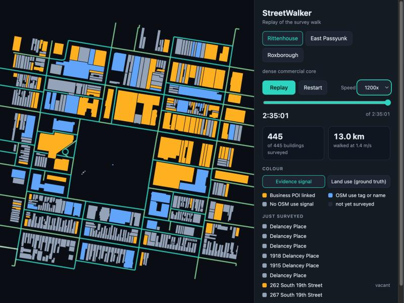
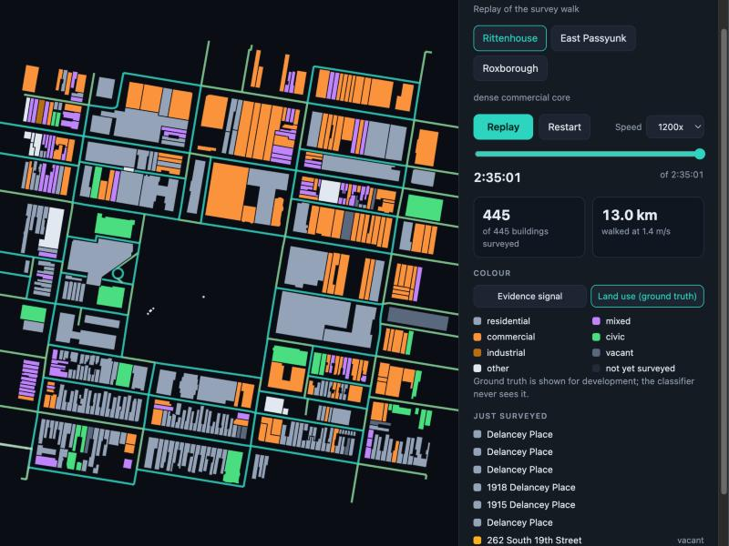

# StreetWalker

A deterministic street survey of three Philadelphia areas. Each building is classified (residential, commercial, restaurant, cafe, and so on) with Jev decisions over OSM tags and geometry, escalating to street imagery and a local vision model only when confidence is low. Its restaurant universe feeds TableMap, a ranking and review-chat layer.

Status: Week 2, the walk is built and replayable (street circuits, frontage assignment, evidence bundles, viewer). See [docs/week1-checklist.md](docs/week1-checklist.md) and [docs/decisions/](docs/decisions/).

## Data policy

Raw data lives in `data/` and is never committed. Yelp data, and anything derived from it, stays private until the Yelp license question in [decision 0001](docs/decisions/0001-yelp-license-and-showcase.md) is resolved.

## Local setup

```bash
cp .env.example .env        # set a local password; add MAPILLARY_TOKEN for the Mapillary step
docker compose up -d db     # Postgres + PostGIS + pgvector on localhost:5433
python3 -m venv .venv && .venv/bin/pip install -e .
.venv/bin/python -m streetwalker.ingest all   # OSM, City of Philadelphia data, Mapillary metadata (~3 min)
```

## Replay viewer

```bash
.venv/bin/python -m streetwalker.export_replay
cd web && npm install && npm run dev
```

Evidence signal (what OSM tells the walker) next to the City's land use (ground truth), Rittenhouse after the full walk:




See [web/README.md](web/README.md).
