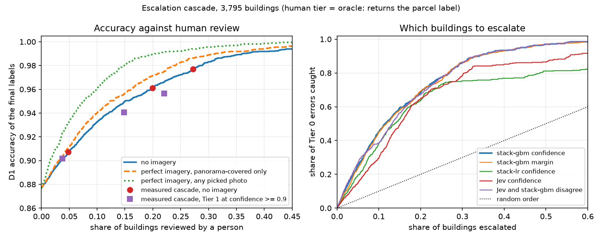
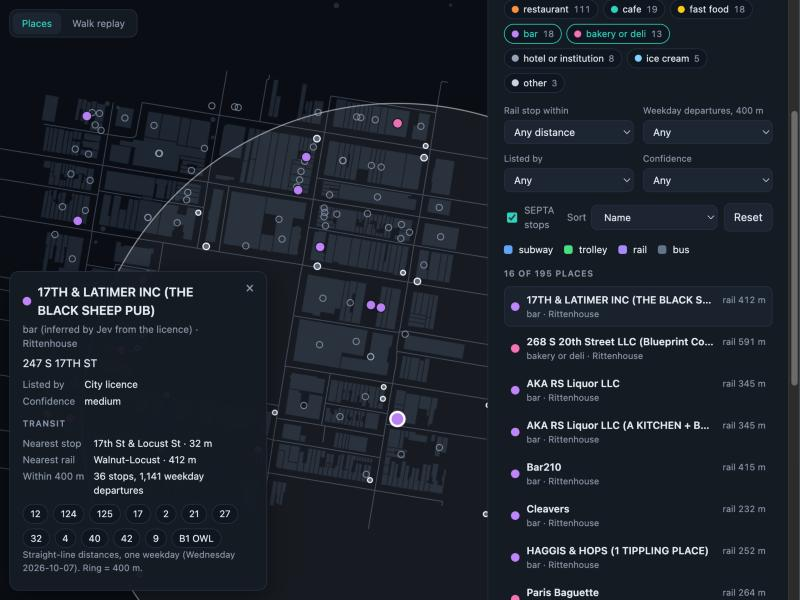

# StreetWalker

A deterministic street survey of three Philadelphia areas. Each building is classified (residential, commercial, restaurant, cafe, and so on) with Jev decisions over OSM tags and geometry, escalating to street imagery and a local vision model only when confidence is low. Its restaurant universe feeds TableMap, a ranking and review-chat layer.

Status: the survey, census, search API, map UI and escalation cascade are built (decisions 0002 to 0018), and the Yelp half is built privately (decisions 0019 to 0023: place links, reviews, provisional aspect ratings, a local search layer; no chat yet). Tier 0 (Jev plus a calibrated stacker) labels 88% of buildings correctly, a confidence gate picks which to escalate, and a human queue handles the rest; the imagery and local-LLM tiers were measured and do not help (decision 0018).

## Data policy

Raw data lives in `data/` and is never committed. Yelp data, and anything derived from it, stays private until the Yelp license question in [decision 0001](docs/decisions/0001-yelp-license-and-showcase.md) is resolved.

## Local setup

```bash
cp .env.example .env        # set a local password; add MAPILLARY_TOKEN for the Mapillary step
docker compose up -d db     # Postgres + PostGIS + pgvector on localhost:5433
python3 -m venv .venv && .venv/bin/pip install -e .
.venv/bin/python -m streetwalker.ingest all   # OSM, City of Philadelphia data, Mapillary metadata (~3 min)
```

## Replay viewer

```bash
.venv/bin/python -m streetwalker.export_replay
cd web && npm install && npm run dev
```

Evidence signal (what OSM tells the walker) next to the City's land use (ground truth), Rittenhouse after the full walk:


See [web/README.md](web/README.md).

## Escalation cascade

Tier 0 answers every building; a gate escalates the ones it is unsure of; a human queue resolves them. At the threshold chosen on train for a 95% accurate kept set (tau 0.77), on the frozen test split: 18% of buildings escalated [12, 30], kept accuracy 94.3%, final D1 accuracy 0.953 (0.884 before), commercial-any F1 0.75 to 0.92. The two intermediate tiers made things worse on the buildings the gate escalates: street-image captions by -0.12 accuracy, a local LLM by -0.11. The cascade works in the rowhouse areas and not in the dense core (Rittenhouse: 75% escalated, Tier 0 not calibrated there). The human tier is an oracle until the review labels exist. See [decision 0018](docs/decisions/0018-escalation-cascade.md).



```bash
.venv/bin/python -m streetwalker.cascade --figure docs/img/cascade-curve.png   # gates, thresholds, tier tables (train + dev; --final adds the logged test read)
.venv/bin/python -m streetwalker.review seed                                    # build the review queues, cache their photos
STREETWALKER_REVIEW=1 .venv/bin/uvicorn streetwalker.api:app --port 8000        # then cd web && npm run dev, open #/review
.venv/bin/python -m streetwalker.review report                                  # agreement with the parcel labels, seconds per label
```

## Restaurant census

195 food and drink places in the three areas (184 public eating or drinking places), from OSM and City food licences matched into one list. OSM finds 42% of the licensed businesses; licences find 71% of OSM's places; capture-recapture suggests about 234 exist. See [decision 0016](docs/decisions/0016-restaurant-census.md).

```bash
.venv/bin/python -m streetwalker.census_area   # builds the place table, prints the census
.venv/bin/python -m streetwalker.census_kind   # Jev kinds for licensed places
```

## Place search API

Each place carries its neighborhood and SEPTA context (nearest stop and rail stop, routes and weekday departures within 400 m), and a read-only API searches them by name, kind, area, location and transit. No Yelp data is involved. See [decision 0017](docs/decisions/0017-transit-neighborhoods-and-search-api.md).

```bash
.venv/bin/python -m streetwalker.ingest septa neighborhoods   # SEPTA GTFS (22 MB) and neighborhood polygons
.venv/bin/python -m streetwalker.enrich                       # write context onto each place
.venv/bin/uvicorn streetwalker.api:app --port 8000            # interactive docs at http://localhost:8000/docs
cd web && npm run dev                                         # map UI at http://localhost:5173 (proxies /api to the API)
curl 'localhost:8000/places?lat=39.9496&lng=-75.1715&radius_m=300&kind=bar&max_rail_m=400&sort=distance'
```



The map UI is described in [web/README.md](web/README.md).

## Yelp link (private)

Census places are linked to Yelp Open Dataset businesses by name, address and building (`yelp_match.py`, [decision 0019](docs/decisions/0019-yelp-match.md)). The Yelp Data and anything derived from it stay on this machine: nothing here exposes it, and the figures live in a gitignored file. Read the Yelp terms in [decision 0001](docs/decisions/0001-yelp-license-and-showcase.md) before showing anything derived from it.

Reviews of the linked places are loaded locally and scored on four aspects (food, atmosphere, service, value) with Jev ([decision 0020](docs/decisions/0020-reviews-and-aspect-scoring.md)). The scores are plausible but **not yet validated against human labels**, and they stay private like the rest.

A labelling page (`#/label`) exists, but **no human labels will be collected** (10 of a planned 180 were done and the owner decided to stop), so the aspect scores are **not validated against people**. They were instead tested on invented reviews with the truth known by construction ([decision 0022](docs/decisions/0022-validating-aspect-scoring-without-labels.md); the test set and its results are in `docs/probe/` and can be shared): clear cases, mentions and levels are handled well, aspects do not leak into each other, there is a small halo from the reviewer's overall verdict, and implicit mentions of value and atmosphere are under-detected. Two no-label reliability checks followed ([decision 0034](docs/decisions/0034-aspect-reliability.md)): a review's score barely moves under neutral edits (on the invented set, a hundredth of a level on a repeat and about a tenth under paraphrase), and a place's score reproduces from two halves of its reviews at close to the star rating's own reliability; reliability is not validity, so the claim below stands. The rating built on the scores is **provisional** and is not presented as a ranking result ([decision 0021](docs/decisions/0021-aspect-labels-and-provisional-rating.md)).

## TableMap search (private, provisional)

A local-only router searches the census together with the provisional aspect ratings and the review text: the `/places` filters, a minimum per aspect (on the mean or the 95% lower bound), and review search with matching passages, lexical (full-text), dense (local `nomic-embed-text` embeddings through Ollama) or both fused ([decisions 0023](docs/decisions/0023-tablemap-retrieval.md) and [0024](docs/decisions/0024-dense-retrieval.md)). It is mounted only when `STREETWALKER_TABLEMAP=1`, so the default API and the map UI stay Yelp-free. Everything it returns says `provisional`, and a sort by a rating is opt-in. Dense matching returns nearest neighbours, not a relevance verdict, and the tests run on invented data.

`POST /tablemap/chat` answers a question with a local model (`qwen2.5:7b` through Ollama, [decision 0025](docs/decisions/0025-chat-over-retrieval.md)): the model plans a search and summarises passages, and code runs the search, checks every quote is verbatim, and writes the names, ratings and caveat itself. The planner (p2, [decision 0029](docs/decisions/0029-planner-v2.md): the model decides scope and topic, rules read kinds, area, rail, aspect levels and sort off the question) scores 29/32 fully correct plans on a held-out invented set, against 19/32 for the first planner ([docs/chat-eval](docs/chat-eval/log.md)); summaries are shown as unchecked. On invented cases the first writer speculated when the passages did not answer the question (about 10%); a separate relevance check before the writer (writer w3, [decisions 0026](docs/decisions/0026-writer-faithfulness.md) and [0027](docs/decisions/0027-writer-v3-verifier.md)) removed that on both halves of the set, at the price of missing about a quarter of the true matches and of extra time per answer. `"style": "quotes"` returns verbatim quotes only (no model-written text, about three times faster; [decision 0028](docs/decisions/0028-check-recall-and-cost.md)).

```bash
ollama pull nomic-embed-text && ollama pull qwen2.5:7b && .venv/bin/python -m streetwalker.embed_reviews   # once, about 17 minutes; hybrid search needs Ollama running (mode=lexical does not)
STREETWALKER_TABLEMAP=1 .venv/bin/uvicorn streetwalker.api:app --port 8000          # then /docs, section "tablemap"
```

## Chat view

`#/chat` in the web app is a chat over the above with follow-ups ([decision 0031](docs/decisions/0031-chat-view-and-multi-turn.md)): a follow-up is rewritten into a standalone question with the earlier turns as context (14/16 plans right on held-out invented conversations against 7/16 without history). Decision [0032](docs/decisions/0032-closing-the-remaining-gaps.md) closed the gaps that left: progress while waiting and a Cancel that stops the model, a conversation that survives a reload (in the browser), "worst" questions answered as the lowest provisional scores first, follow-ups that only add a condition, and complete questions no longer merged with the last turn (a defect in the first rewrite, found by clicking). Three further candidates (planner p4, strict matching, a rewrite variant) missed their own pre-registered bars and are options, not defaults. See [web/README.md](web/README.md).

## Continuous integration

`.github/workflows/ci.yml` runs lint, the web checks and the Python suite (several hundred tests, including the retrieval evals and a test that recomputes every published figure from the committed run files) on invented data only. What needs a model or the real database stays local: see [docs/ci.md](docs/ci.md) and [decision 0030](docs/decisions/0030-ci.md). Its first run on GitHub passed (both jobs): see [docs/ci.md](docs/ci.md).

## Attribution

Map data © OpenStreetMap contributors (ODbL). Business licenses and land use: City of Philadelphia via OpenDataPhilly. Transit: SEPTA GTFS. Neighborhood boundaries: OpenDataPhilly, CC BY 4.0, Robert Cheetham / Azavea. Street imagery: Mapillary, CC BY-SA 4.0.
